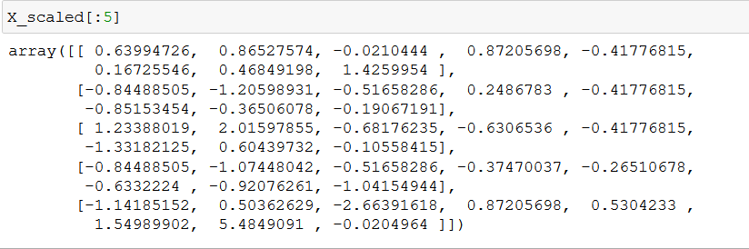
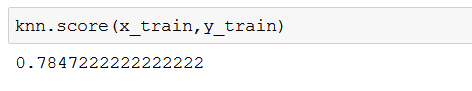
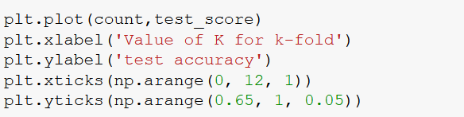
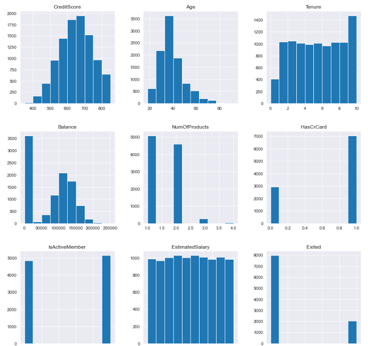
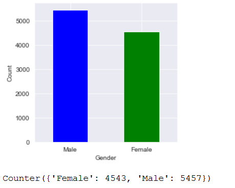
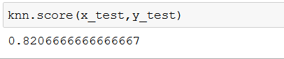

**LAB 1: INTRODUCTION TO MACHINE LEARNING**

In this lab, we will cover supervised learning, unsupervised learning, classification problem, understanding the k-nearest neighbor’s algorithm, evaluation metrics for a classification model, model fitting, and hyperparameter tuning.

#### Pre-reqs:
- Google Chrome (Recommended)

#### Lab Environment
Notebooks are ready to run. All packages have been installed. There is no requirement for any setup.

All examples are present in `~/work/machine-learning-essentials-module2/lab_1` folder. 

**Binary Classification for Machine Learning**

The most popular algorithms which are used for binary classification are: 

- K - Nearest Neighbours
- Logistic Regression
- Support Vector Machine
- Decision Trees
- Naive Bayes

Out of the mentioned algorithms, some algorithms were specifically designed for the purpose of binary classification and natively do not support more than two types of class. some examples of such algorithms are Support Vector Machines and Logistic Regression. now we will create a dataset of our own and use binary classification on it. we will use the make\_blob() function of the scikit-learn module to generate a binary classification dataset. The example below uses a dataset with 1000 examples that belong to either of the two classes present with two input features.

**Code**

**Output:**

The above example creates a data set of 5000 samples and divides him into input “X” and output “Y” elements. the distribution shows us that any one instance can either belongs to either class 0 or Class 1 they are approximately 50% in each.

The first 10 examples in the data set are shown with the input values which are numeric, and the target value is an integer which represents a class membership.

Then a scatter plot is created for the input variables where the resultant points are color-coded based on the class values. we can easily see two distinct clusters which we can discriminate.

Multi-class classification

The most common algorithms which are used for multiclass classification are:

- K - Nearest Neighbours
- Naïve Bayes
- Decision Trees
- Gradient Boosting
- Random Forest

You can also use the algorithms for binary classification here on a basis of either one class versus all the other classes, also known as one versus rest, or one model for a pair of classes in the model which is also known as one versus one.

**One Vs Rest** – The main task here is to fit one model for each class which will be versus all the other classes

**One Vs One** – The main task here is to define a binary model for every pair of classes.

we will again take the example of multi-class classification by using the make\_blob() function of the scikit learn module. 

The following code demonstrates it.

**Code:**

Here you can see that there are more than two class types, and we can classify them separately into different types.

Multi-Label Classification

**Output:**

**Imbalanced Classification**

Now we will look to develop a data set for the imperative classification problem. we will use the classification function of scikit learn to generate a full list synthetic and imbalanced binary classification dataset of 1000 samples

**Code:**

**Output:**

Here we can see the distribution of the labels and we can see a severe imbalance of the data classes where 983 elements belong to one type and 17 belong to another type. you can see most of the type 0 or class 0 are expected. these types of datasets are more difficult to identify but they have a more general and practical use case.

Let’s start our machine learning journey with a very simple machine learning algorithm called KNN (K-Nearest Neighbours)

**Mini Exercise** 

Let’s see the practical implementation of all the concepts.

We will be using the diabetes dataset for this exercise

Let’s import the dataset to start our analysis.

There are 8 independent variables and 1 dependent variable (Outcome). Here we want to predict the presence of “diabetes” given the health parameters like “Pregnancies”,” Glucose”, “BloodPressure” and so.

After doing the data exploration, data cleaning, and scaling the data we ended up with the below data.

Let’s split data into training and test sets to fit our model.

Initially, I am going to fit the KNN classifier model with default parameters and see how our model performs with default parameters.

The accuracy score of the KNN model with default parameters on the training set is 81.94%

Let’s how the model performs on the test set.

The accuracy score on the test set is 72.91%, which is far different from our training set. It clearly states that our model is overfitting to our training set.

**Hyperparameter tuning**

We can perform the hyperparameter tuning using the “GridSearchCV” method from the sklearn package. GridSearchCV implements a “fit” and a “score” method. It also implements “score\_samples”,” predict\_proba”, “decision\_function”, “transform”, and inverse\_transform” if they are implemented in the estimator used. The parameters of the estimator used to apply these methods are optimized by cross-validation grid search over a parameter grid.

First, create a grid with parameters with which we want to tune our model.

Created grid with three parameters such as ‘algorithm’, ‘leaf\_size’, and ‘n\_neighbors’ and passed a variety of values to check the best parameters out of the following parameters.

The above codes created a gridsearch object and fitted the model with hyperparameters. Let’s check the best parameters.

We can see that “ball\_tree” algorithm with 18 “leaf\_size” and 9 ‘n\_neighbors’ gave the best results for our data.

Now we can go ahead and build the model by passing these parameters.

Looks like accuracy for training has decreased, maybe our model was overfitting the data before. Let’s see how it performs on the test data.

Great, accuracy score has increased for our test data. So, indeed our model was overfitting before, Now, it looks better.

**Cross-Validation**

**Exercise:**

Let’s use k-fold cross-validation and check how well our model is generalizing over our dataset: We are randomly selecting our k to be 12 for the ‘k’ fold.

Let’s visualize the test accuracy with the value of k in k-fold

The average train score is: 79.71%

The average test score is: 75.26%

Our cross-validation tells that on average our model has 75% accuracy on our test data. So, that’s how we can use cross-validation to compute how well our model is generalizing on our data.

Let’s use our skills which we have learned till now and solve the below use case 

**Case Study**

Using a source of 10,000 bank records, we must create a model to demonstrate the ability to apply machine learning to predict the likelihood of customer churn. 

This data set contains details of a bank’s customers, and the target variable is a binary variable reflecting the fact whether the customer left the bank (closed his account), or he continues to be a customer.

**Importing the dependencies**

**Data importing and Exploring**

Exploring the variables data types, and looking for any null values

There are no “null” values in any of the variables

Let’s check for any duplicate values in the dataset.

Unused Features: To make the data frame easily readable we will drop features that do not have any importance in building a machine learning model.

- RowNumber
- CustomerId
- Surname

These features won’t contribute to modeling building, we can go ahead and drop them from our dataset.

Now we can start our analysis, let’s start with understanding the distributions of the numeric features by plotting the histogram grid

Let’s also look for a summary statistics for the numeric features

From the summary statistics and the histograms, we can conclude that all the features look good. We don’t see any extreme values for any feature.

Let’s analyze the distributions of categorical features

**Data Visualization**

We will start with the “gender” variable and see how data points are distributed among the gender.

Bivariate analysis with the target variable

Reorganizing the data frame for visualization

Churn segmentation based on geography

Reorganizing the data frame for visualization

Checking the correlation between numeric variables

Generating a heatmap to visualize the correlation

Most of the variables were having a very weak negative correlation with the target variable “Exited”. “Age”, “Balance” and “Estimated Salary” are having very weak positive correlations.

Creating a pair plot to visualize the relationship between “Exited” and independent variables like “Age”, “IsActiveMember”, “NumofProducts”, “Balance”.

From density plots, we can see that older customers and customers with more products more often leaving the bank.

Let’s create a violin plot segmenting “age”, “Balance”, “Number of Products” and “Active Membership” with “Exited”

Violin plots are confirming the earlier statement that older customers and customers with more products are more likely to leave the bank.

Finally, let’s check the distribution of our Target feature

Let’s define a small helper function that displays the count and percentage per class of the target function.

We can see that our dataset is imbalanced. The majority class, “Stays” (0), has around 80% data points and the minority class, “Exits” (1), has around 20% data points.

To address this, in our machine learning algorithms we will use SMOTE (Synthetic Minority Over-Sampling Technique).

**Finalizing the Data frame**

Let’s check our final dataset before we proceed further with model building.

Our dataset looks good, and it is ready to be saved.

Now let move to the model building part before that we need to load a few more libraries to proceed further.

We must create a dummy variable of the categorical features.

We have a filtered all the features with the ‘object’ data type and assigned them to ‘cat\_subset’.

You can see we have used the “get\_dummies” method from the ‘pandas’ package and created dummy variables.

In a similar way, creating a numeric subset using the below code.

Now, we have concatenated the numeric and categorical subset and assigned to data.

Now I’m going to separate the independent and dependent features and assign them to X and y respectively.

Great!!! Let’s proceed by splitting the data into train and test sets. Before that, we should scale our data. Let’s use the ‘MinMaxScaler” for that.

**Train and Test Split**

Let’s fit the data into the KNN model and see how well it performs

Wow!!! Our model performed well on the training set. Let’s go ahead and check the performance of the test set.

Great!! The model performed well even on the test set. Let’s try to increase the accuracy by using hyperparameter tuning.

Let’s see the best parameters according to gridsearch

We will use the best parameters in our KNN algorithm and check if our accuracy is increasing.

Looks like accuracy for training data has decreased, let’s see how it performs on the test data.

There is no change in the accuracy of our test data. 

Accuracy is always not the best metric for the classification problem. Let’s look at metrics for classification models

**Evaluation of Classification Model**

Let’s check the performance of the model using the confusion matrix, precision, recall, and f1 score.

The precision, recall and f1score are not up to the mark. The main reason for the score is less is the class imbalance problem.

Almost 80% of our data belongs to one class. Our model is more biased to class “0”. The solution for this could be SMOTE (Synthetic Minority Oversampling Technique). 

Let’s now use k-fold cross-validation and check how well our model is generalizing over our dataset: we are randomly selecting our k to be 10 for the ‘k’ fold.

Let’s plot the test accuracy with the value of k in k-fold.

The average train score is: 85.34%

The average test score is: 81.95%

Our cross-validation tells that on average our model has 81% accuracy on our test data. So, that’s how we can use cross-validation to compute how well our model is generalizing on our data.

**SUMMARY**

Throughout the lab, we have walked through a complete end-to-end machine learning use case. We started with an introduction to machine learning, probability, supervised and unsupervised learning then moved on to the use case. We imported the data, done with data cleaning, moved on to the model building, and finally looked at how to generalize the model. As a reminder, the general structure of the machine learning project is below:

- Data importing
- Data cleaning
- Exploratory data analysis
- Feature Engineering and selection
- Building the machine learning model
- Performing hyperparameter tuning
- Evaluate the model on the test set

While the exact steps vary by project, and machine learning is often an iterative rather than linear process, this lab should serve you well as you tackle future machine learning labs.

**Program Assignment**

Using the dataset used in the case study. Perform the following tasks.

1) Data Cleaning
1) Experiment with different values of k
1) Validate the model using LOOCV
1) Evaluate the model performance

**Assessment**

**Choose the appropriate option**

1) In what type of learning labeled training data is used?

1. Unsupervised Learning
1. Supervised Learning
1. Reinforcement Learning
1. None of the above

1) What characterizes unlabelled examples in machine learning?

1. There is no prior knowledge
1. There is no confusing knowledge
1. There is prior knowledge
1. There is plenty of confusing knowledge

1) Which of the following is the best machine learning method?

1. Scalable
1. Accuracy
1. Fast
1. All of the above

1) Data used to build a data mining model.

1. Training data
1. Validation data
1. Test data
1. Hidden data

1) The problem of finding hidden structures in unlabelled data is called.

1. Supervised learning
1. Unsupervised learning
1. Reinforcement learning
1. None of the above

**Fill in the spaces with appropriate answers**

1) When model fits very well to the training data and not perform well on test data such kind of issue is called as \_\_\_\_\_\_\_\_\_\_\_\_\_\_\_\_\_\_\_\_\_\_\_\_\_\_\_\_\_\_

1) What is “K” in the KNN Algorithm?

1) KNN Algorithm is known as \_\_\_\_\_\_\_\_\_\_\_\_ Learner.

1) Choosing the right value of K is done through a process known as \_\_\_\_\_\_\_\_\_\_\_\_\_\_\_\_\_.

1) If K value is too large, then our model is \_\_\_\_\_\_\_\_\_\_\_\_\_.

**True or False**

1) Accuracy is the best evaluation metric for classification problems.

1. True
1. False

1) KNN can be used to solve both classification and regression problem statements.

1. True
1. False

1) KNN is a Parametric algorithm

1. Ture
1. False

1) In K-fold cross-validation, the entire data is used for training.

1. True
1. False

1) In LOOCV, all of the data except one record is used for training and one record is used for testing.

1. True
1. False

**Assessment Solutions**

**Choose the appropriate option**

1) B
1) D
1) D
1) A
1) B

**Fill in the spaces with appropriate answers**

1) Overfitting
1) Number of Nearest Neighbours
1) Lazy
1) Hyperparameter Tuning
1) Underfitting

**True or False**

1) False
1) True
1) False
1) True
1) True

